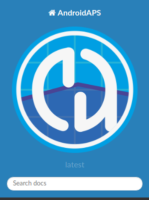
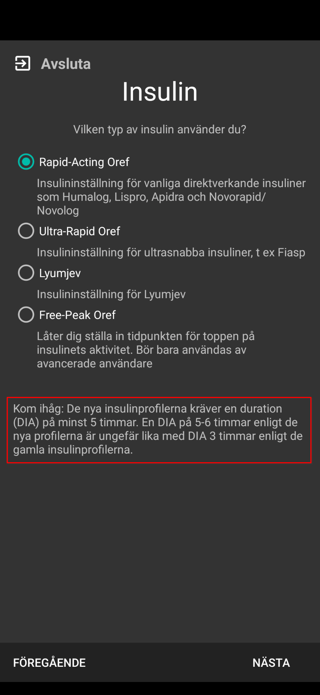
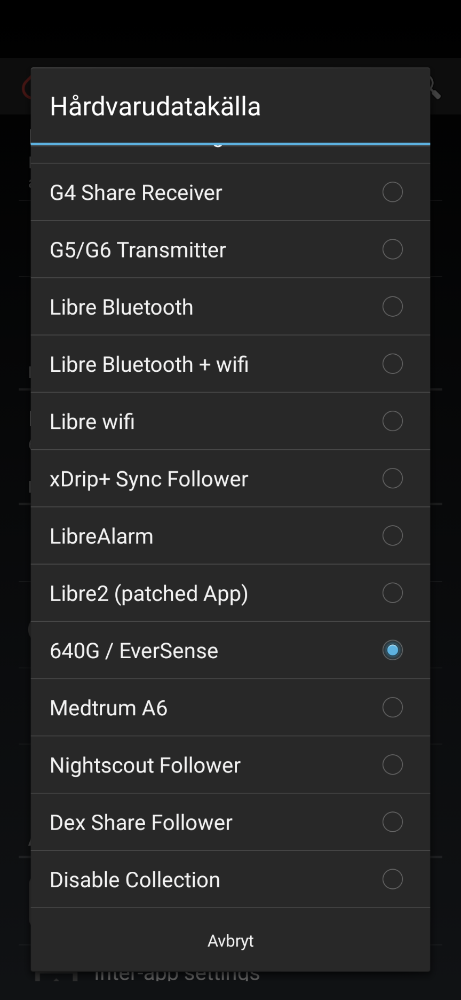
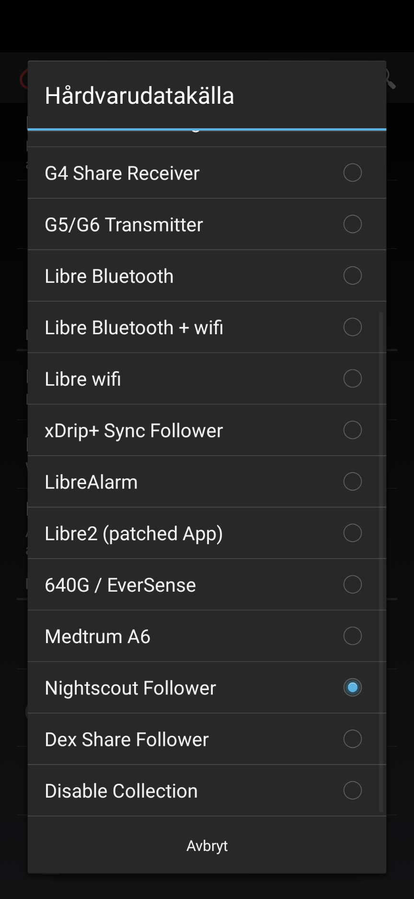
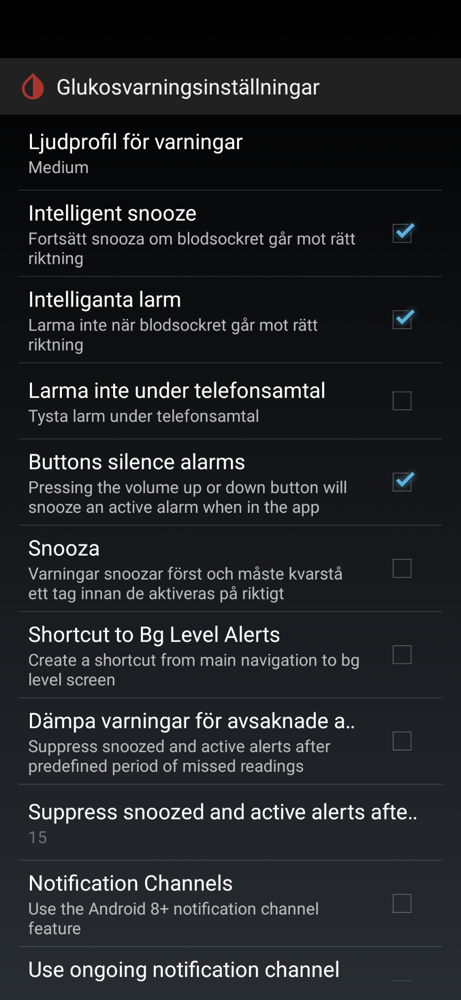
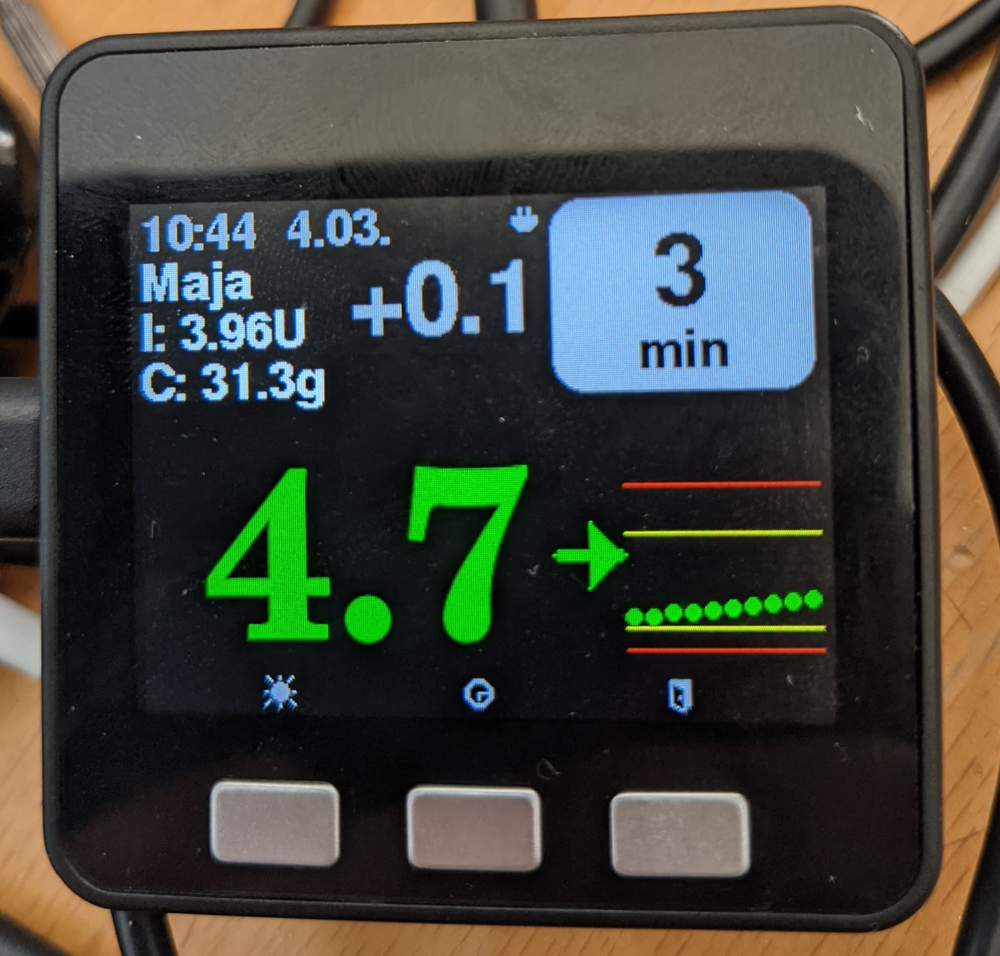
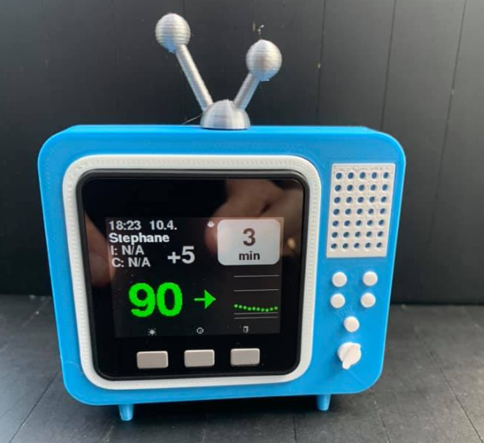

# AAPS
AAPS (AndroidAPS) är byggt med ett stort säkerhetstänk och du kommer (till skillnad från ios-loop) INTE tillåtas att slå på en loop som är helt självgående och pytsar i insulin från början, utan du lotsas genom ett helt gäng "Mål" som du måste ta dig igenom och sakta men säkert öppna upp fler funktioner som tillslut gör loopen mer och mer självgående och kraftfullare. 
Se till att du läser på  hur appen fungerar så att du kan styra den på ett säkert sätt. [Dokumentationen](https://androidaps.readthedocs.io/en/latest) är på engelska, men lättläst - är det nåt du inte förstår, så ställ en fråga i fb-gruppen [Looped - Sweden](https://www.facebook.com/groups/loopedsweden) eller den internationella [AndroidAPS users](https://www.facebook.com/groups/AndroidAPSUsers). Tips är också att sökfunktionen är bra (dock kan det vara svårt att komma på översättningen då AAPS-appen är på svenska)

AAPS och installationsprocess är väldokumenterad, men jag tycker att den saknar en röd tråd för hur allt hänger ihop så jag tänkte förtydliga lite med ett exempel på hur jag har satt upp systemet.

# Förklaring av alla ingående komponenter
Här nedan ser du hur vi satt upp vårt system. Har inte mer än testkört NSClient-appen, då användaren i vårt fall är självgående, men tog med den som ett exempel.

- [AAPS](#aaps)
- [Förklaring av alla ingående komponenter](#förklaring-av-alla-ingående-komponenter)
  - [Pumpar](#pumpar)
  - [CGM](#cgm)
  - [Nightscout](#nightscout)
  - [Hur installerar man en app som inte kommer från google](#hur-installerar-man-en-app-som-inte-kommer-från-google)
  - [Dexcom BYODA](#dexcom-byoda)
  - [Installera Nightscout](#installera-nightscout)
  - [Bygg AAPS](#bygg-aaps)
  - [Installationer på telefon](#installationer-på-telefon)
    - [Dexcom](#dexcom)
    - [AAPS](#aaps-1)
      - [Installationsguide:](#installationsguide)
      - [Målen i AAPS](#målen-i-aaps)
  - [Klocka](#klocka)
  - [NSClient (för föräldrar/följare)](#nsclient-för-föräldrarföljare)
  - [xDrip+](#xdrip)
  - [Gadgets](#gadgets)
    - [M5Stack Nightscout](#m5stack-nightscout)
    - [NightStander](#nightstander)

## Pumpar
AAPS stödjer [flertalet pumpar](https://androidaps.readthedocs.io/en/latest/Hardware/pumps.html) varav några har stöd för blåtand så att de kan prata direkt med telefonen som kör AAPS, andra måste ha en länk mellan telefonen och pumpen (Rileylink, orangelink, emalink - de är samma länk-prylar som används av ios-loopare!):
- Accu-Chek Combo
- Accu-Chek Insight
- DanaR/RS/i
- Diaconn G8
- Omnipod Eros*
- **Omnipod DASH**
- Medtronic pumps*

*Behöver en Rileylink då de inte har bluetooth!

Vi har gått över till Omnipod DASH som har fått fullt stöd nu i AAPS 3.0. Fördelen med DASH över EROS är att den kommunicerar över blåtand och då behövs inte en Rileylink. Sitter du på Eros kan jag tipsa om att direkt ansöka om att få byta till DASH! Vi fick byta på en vecka trots att receptet hade långt kvar på Eros! Mycket bättre kontakt, en färre pryl att ha koll på/ladda och den återansluter jättebra vid tappad kontakt! Notera dock att [inte alla Android-telefoners](https://docs.google.com/spreadsheets/d/1zO-Vf3wv0jji5Gflk6pe48oi348ApF5RvMcI6NG5TnY) blåtand fungerar så bra med DASH's då den är väldigt energisnål"!

## CGM
Alla loop-system är beroende av en stabil och korrekt CGM (koninuerlig glukos-mätare) som levererar ett BG-värde minst var 5e minut. AAPS rekomenderar i nuläget Dexcom G6, då det är den som har tillräckligt stabil mätning och utjämnande algoritm för att kunna aktivera den mer aggresiva typen av loop (SMB). Det går att loopa med [de andra systemen också](https://androidaps.readthedocs.io/en/latest/Configuration/BG-Source.html), men då kommer AAPS inte tillåta användning av SMB (Super micro bolus) fullt ut, vilket vore tråkigt att vara utan - men funkar helt ok ändå, bara inte lika aggresivt. 

Nu för tiden rekomenderar utvecklarna av AAPS att vi använder den så kallade BYODA ("Bygg din egen Dexcom-app"), vissa använder xDrip för att hämta BG-värden från sändaren, men den har inte lika bra back-fill funktionsalitet som BYODA (vid missade värden) så vi har bara använt BYODA! En annan fördel med BYODA är att den fortfarande skickar upp värden till dexcoms servrar och då fortfarande fungerar med Diasend!. 

Jag kan ändå verkligen rekommendera att ni installerar xDrip+appen också då den har fantastiska "smarta" larm som kan konfigueras att agera olika beroende på dagar/tider och om BS är på väg åt rätt håll eller bara larma vid bestående hög mm. xDrip funkar både på loop-telefonen och på följar-telefoner (loop-telefonens xDrip får värden direkt från BYODA, följarnas hämtas via NS)

Vill du byta från ios loop till AAPS, så kan du börja med att köra dubbelt ett tag (upp till mål 5!?), då kör du virtuell pump och ställer in `NSClient BG` som din BG-källa, så laddas de i stället ner från NS. 

## Nightscout
Nightscout (NS) är en moln-baserad tjänst som sparar och visualiserar/tillhandahåller historisk data från ditt loop-system. AAPS skickar upp sina värden och beräkningar till NS var 5e minut och NS tar emot datan och lagrar den i en databas som du själv har satt upp och har full kontroll över (Mongodb i Atlas).

AAPS i sig är inte beroende av någon extern databas/tjänst (NS), men eftersom de absolut flesta användarna vill kunna titta på historisk data (längre tillbaka än de 48h som AAPS håller) och ha möjlighet för t.ex. föräldrar att följa AAPS på distans, så är det i nuläget tvingande att ha en NS (Nightscout) i de första målen och när man installerar AAPS. Till skillnad från att logga in på Dexcom och titta på dina BG-värden, kommer du kunna se ALL data i NS så som måltider, bolusar, temporära basaler och profilbyten. 

Det är väldigt viktigt att den som loopar förstår hur loopen tänker, och att man förstår varför den gör som den gör i olika lägen! Det lär man sig absolut bäst genom att titta på historisk data i t.ex. NS-hemsidans rapport-verktyg där det framkommer väldigt tydligt hur AAPS har jobbat.

Obs, jag har modifierat koden lite och bl.a. flyttat upp IOB och COB-graferna och ändrat lite text mm, så din NS-rapport kommer inte se ut precis som bilden ovan! vill du testa det, får du istället forka [min fork av nightscout](https://github.com/klalle/cgm-remote-monitor) i installations-steget

## Hur installerar man en app som inte kommer från google
1.  Stäng av "Play protect"
    - Play protect ska behållas avslagen då den annars kommer försöka stänga av alla dina AAPS-appar varje natt!
    - Inställningar/Säkerhet/Appsäkerhet/Kugghjulet uppe till höger
        - Stäng av både "Sök igenom appar" och "Förbättra appidentifiering"
    - Använd Inställningarnas sökfönster och sök efter "Appsäkerhet" eller "protect" om du inte hittar inställningen!
2. Tillåt installation från annan källa
    - Flera av systemen som kommer bygger på att du installerar en app på telefonen som inte finns på google-play. För att kunna göra det måste du gå in på inställningar och berätta för telefonen att förslagsvis "Drive" (google drive). 
    
    - På min telefon (Google pixel 4a med android 12) hittas denna inställning: 
        - Inställningar/Appar/Särskild appåtkomst/Installera okända appar
        - Använd Inställningarnas sökfönster och sök efter "okända" eller "installera" om du inte hittar inställningen!
        - I den listan väljer "Drive" och tillåter att den får installera andra appar.
        - 

    - Dropbox funkar också, men tillåter inte direktinstallation från appen, då måste man först kopiera apk-filen till telefonens internminne (tre punkter/Exportera/Spara till Enhet) och sedan tillåta att t.ex. "Files by google" får installera appar (likt steget för Drive ovan).

## Dexcom BYODA
Den oficiella Dexcom-appen är låst till att bara fungera på vissa mobiler och den är också låst till att bara skicka sin data till Dexcom-share. Du behöver en Dexcom-app som förutom att skicka till Dexcom-share och diasend, också delar med sig av BG-värden till AAPS (och xDrip). För detta finns en patchad (hackad) variant som du själv [konfigurerar/bygger i ett google-formulär](https://docs.google.com/forms/d/e/1FAIpQLScD76G0Y-BlL4tZljaFkjlwuqhT83QlFM5v6ZEfO7gCU98iJQ/viewform?fbzx=2196386787609383750&fbclid=IwAR2aL8Cps1s6W8apUVK-gOqgGpA-McMPJj9Y8emf_P0-_gAsmJs6QwAY-o0) och sedan får en länk att ladda ner appen (apk-filen).
När du fyller i detta formulär är det viktigt att du väljer rätt på dessa inställningar: 

Tillåt att den installeras på ALLA android-telefoner

Versionen av dexcom som vi har i Europa:

Skippa INTE de 2h warmup utan värden och tillåt att dexcom skikar värden internt inom telefonen till AAPS och eventuellt xDrip (välj detta även om du inte har xDrip till att börja med)

Resten är ganska själv-förklarande tror jag (använd default-värdena på de du är osäker på)

Du får nu ett mejl med en nedladdningslänk inom 5min som du laddar ner och lägger på Drive. OBS! Kolla skräpposten, där hamnade mitt mejl iaf! 

Under tiden så kan du passa på att ladda ner xDrip+ [här](https://xdrip-plus-updates.appspot.com/stable/xdrip-plus-latest.apk) som du också lägger på Drive (den kommer du vilja ha för larm!).

## Installera Nightscout

Installation av NS är väl beskrivet i detalj [här](http://nightscout.github.io/nightscout/new_user/), vill du i stället ha det berättat för dig, så har Jonas Hummelstrand gjort en [youtube-tutorial](https://youtu.be/rNIpmIhPCpU) på svenska där han går igenom processen steg för steg. OBS! Skippa allt som har med BRIDGE att göra (steg 13 och framåt), du ska INTE sätta upp Dexcom bridge då vi istället ska skicka upp all data direkt från AAPS. 

När du är klar med detta steg så har du fortfarande ingen data att visa, men det ska gå att komma åt NS-hemsidan i en webläsare!

## Bygg AAPS
För att verkligen vara tydlig med att detta är ett DIY-system och att du tar fullt ansvar för alla följder som kan tänkas bli, så måste du själv ladda ner koden från Github och bygga appen. Jag tänkte inte gå igenom alla steg då de är väl beskrivna [här](https://androidaps.readthedocs.io/en/latest/Installing-AndroidAPS/Building-APK.html), men som det ser ut nu, så är ett av de sista stegen i `Build the app` fel, och gör att många fastnar... 

I steget när du har byggt appen i AndroidStudio och öppnar "Event log" så kommer det inte alls stå att du byggt "1 variant" med en länk. Det du egentligen ska kolla efter är att det INTE står nåt i stil med: 

`Generate Signed APK: Errors while building APK. You can find the errors in the 'Messages' view.`

Om allt har gått bra så står det bara:

`Generate Signed APK: APK(s) generated successfully for module 'AndroidAPS.app' with 0 build variants:` 

Och nu måste du själv leta reda på apk-filen som kommer ligga under mappen som du laddade ner all kod till (inte androidStudio, utan AAPS-koden) och där i har det skapats en mapp "app" där du hittar:
`app/full/app-full-release.apk`. 

Ta nu och ladda upp `app-full-release.apk` till Drive och du kan från och med nu fokusera helt på mobiltelefonen.

## Installationer på telefon
Nu kommer det roliga.
Förutsättning är att du har Drive på telefonen så att du ser dina uppladdade appar (.apk-filer)

### Dexcom
Läs mer [här](https://androidaps.readthedocs.io/en/latest/Hardware/DexcomG6.html#if-using-g6-with-build-your-own-dexcom-app) om du vill se vad dokumentationen säger...
- Om du har kör original-dexcom-appen och har en aktiv sensor+sändare så kan du byta till BYODA utan att förlora någon av dom!
    - Gå in i original-Dexcom-appen och skriv noga ner de sensor-koden och sändar-serienummer som du har för de aktiva sensorn och sändaren. 
    - Avinstallera dexcom-appen
    - Installera den nya BYODA-dexcom-appen som du lagt på Drive genom att trycka på den.
    - Logga in som vanligt och aktivera sensor-kod och sändar-serienummer.
    - Sen står det såhär (kommer inte ihåg om det var nåt jag gjorde) 
        - In phone settings go to apps > Dexcom G6 > permissions > additional permissions and press ‘Access Dexcom app’.
    - Efter ett tag så kommer appen hitta sändaren och börja logga värden precis som förut. Enda skillnaden är att den också tillåter AAPS/xdrip att få tillgång till datan. 

### AAPS
Installera nu AAPS genom att trycka på `app-full-release.apk`-filen i Drive
Tror att du automatiskt kommer till "Installationsguiden" (hittas annars i menyn 3-punkter övre högra hörnet/installationsguide)
#### Installationsguide:
- Alla inställningar kommer kunna ändras senare, så ingen panik att det måste bli rätt från början. Du kommer INTE tillåtas att slå på en loop som är helt självgående och pytsar i insulin från början, utan du lotsas genom ett helt gäng "Mål" som du måste ta dig igenom och sakta men säkert öppna upp fler funktioner som tillslut gör loopen mer och mer självgående och kraftfullare. 
- Se lite screenshots nedanför denna lista: 
- Godkänn allt som AAPS vill ha, behövigheter/platsåtkomst mm
- Välj ett "Huvudlösenord" som du skriver upp (går att återskapa...)
- Det ploppar upp notiser om att "ingen profil vald" - det är ok
- Visningsinställningar har inget med loopen att göra, visar bara grönt område på grafen!
- NSClient - tryck på "Aktivera NSClient" och fyll i din NS-adress (inkl `https://`) och verifiera att du får kontakt (Status: `Authenticated (RWT)`)
- Välj insulintyp (notera här att DIA inte kommer vara det du är van vid!)
- Välj BG-källa (dexcom) och fyll i att du vill `Ladda upp BG-data till NS`
    - OBS! vanligt att inte få in BG-värdena i AAPS i detta steg! Då väljer du en annan BG-källa, och sedan direkt tillbaka till dexcom, för att trigga en liten popup som frågar om tillstånd...
- Profil, AAPS jobbar med profiler man kan byta mellan som håller koll på inställningarna:
    - IC (insulin till kh-kvot, hur många gram kh tar en enhet insulin hand om)
    - ISF (insulinkänslighetsfaktor, hur många mmol/l i BG sjunker du på en enhet insulin)
    - basal
    - Mål (BG-målvärde/område)
    - OBS! loopen tar för givet att dessa är korrekta och får därför svårt att jobba om du inte testar dessa med jämna mellanrum. Ofta varierar de dessutom över dygnet, så du kan speca olika värden för olika timmar i alla utom Mål-värdet. 
- Profilbyte (appen vill att du gör ett första profilbyte, så att den väljer din nyskapade profil, ändra inga värden, tryck bara "Genomför profilbyte"/"OK"!)
- Pump - välj "virtuel" pump först för att ha nåt att jobba med i första målet (du behöver ingen riktig pump förän mål 5, men antar att du vill ansluta den så snart du kan) Du kan också kryssa i att ladda status upp till NS.
- APS - vilken algoritm ska AAPS jobba efter - i senare skede kommer du gå över till SMB, men det får du inte tillgång till förän ett långt senare skede, så börja med AMA som det står där.
- APS-läge - Börja med öppen loop (du måste manuellt genomföra alla ändringar. Du har ändå ingen rättighet att sätta på closed loop än...)
- Känslighetsavkänning - sätt oref1. 

     
  
   
 

Du hittar alla viktiga saker i de två menyerna i vardera övre hörnen. Jag kan inte gå igenom allt, du måste själv bekanta dig med var du hittar allt! Se [AndroidAPS screens](https://androidaps.readthedocs.io/en/latest/Getting-Started/Screenshots.html) för mer info!
Men här är lite kort info:
- "Hamburgermenyn" (de tre strecken uppe i vänstra hörnet) där du (förutom genvägar till vald pump/insu/cgm mm) når:
    - Mål - det här är där du måste klara av målen ([Objectives](https://androidaps.readthedocs.io/en/latest/Usage/Objectives.html) på engelska)
    - Underhåll - här exporterar du dina inställningar (Gör det efter varje klarat mål, och lägg på Drive så att du kan återskapa var du var i målen om mobilen dör!)
    - Konfiugreringsverktyget
     inställningar (kugghjul) och väljer vilka flikar som ska synas (gröna ögat -> tryck i checkboxen så aktiveras en ny flik i huvudfönstret)
- Högermenyn (tre prickar uppe till höger) här nås massor av inställningar 

  

Nu är det bara att börja jobba dig igenom Målen ett efter ett (läs snälla på om varje mål! finns länkar vid varje mål i appen och du har ju länken till "[Objectives](https://androidaps.readthedocs.io/en/latest/Usage/Objectives.html)"). När du är klar kommer du ha en vältrimmad loop som du förhoppningsvis vet hur du ska justera när insulinkänsligheten förändras. 

#### Målen i AAPS
[Målen 1-11](https://androidaps.readthedocs.io/en/latest/Usage/Objectives.html) tar dig från genom alla steg för som gör att AAPS får mer och mer mandat att ta egna beslut och ge kraftigare och kraftigare korrigeringsdoser. Mål 3 är det som de flesta fastnar på och har frågor om, så jag tänkte förklara lite: 
- **Mål 1**
    - Valt din profil
    - Fått BG-data från sensor
    - Har kontakt med NS
    - 
- **Mål 2**
    - Testa lite funktionalitet genom att:
        - Sätta temporär profil
        - Koppla från pumpen å åtekloppla efter 1h (obs, detta är ett mål som inte är så logiskt när man kör omnipod, men du behöver ju inte ta av dig pumpen ändå, bara koppla från anslutningen till AAPS...)
        - Skapa ett TT (Temporärt BG-mål)
        - Ändra lite vad som syns i AAPS
- **Mål 3**
    - Bevisa din kunskap - Här är det många som fastnar då vissa frågor är lite konstiga. Jag reder ut de som jag tycker är knasiga:
    - **insulinkänslighetsfaktor (ISF)**
        - *ISF bör anges i dina AndoidAPS-inställningar*... 
            - hint: profilen räknas inte som AndroidAPS-inställningar
    - **Profilbyte**
        - *ISF kommer att bli 10% högre*
            - Jag hävdar att de har räknat fel här... ISF/0.9 blir inte 10 % högre, men det blir åtminståne inte lägre - så svara med en avrunding så blir det rätt!
    - **Brusiga CGM-värden"**
        - *Inaktivera closed loop-läge för att undvika över- eller underdosering*
            - Ja, på pappret, men frågan är hur många som gör det... men visst - tänk JÄTTE-brusiga värden som får loopen att gå bananas.
        - *Kontrollera att din CGM-app ger utjämnande data.*
            - Den här frågan är nog inte utformade för BYODA-användare... om man däremot använder xDrip för att läsa ut BG, så finns valet att använda Dexcoms utjämnande algoritm, och vet man det så blir frågan med logisk
    - **Insticksprogram för känslighet**
        - *Insticksprogram för känslighet ger användaren föreslagna ändringar av basaldoser, KH-kvoter och insulinkänslighetsfaltprer som kan användas för att redigera profilen.*
            - läs: ger autosens förslag på nya värden för IC, ISF och basal?
        - *Vissa av insticksprogrammen har konfigurerbara tidsintervall som kan ställas in av användaren*
            - hint: finns det nåt plugin som det går att ange ett tidsintervall på (har inget med autosens att göra)
    - **Aktivt Insulin (IOB)**
        - Hint IOB är allt insulin i kroppen utöver det som är basal!
- **Mål 4**
    - Öppen loop
        - Du får förslag av AAPS som du manuellt får godkänna - du måste agera på **minst 20st** för att bli godkänd och hålla på **minst 7 dagar**.
        - Ställ in ett högre spann som BG-målvärde så slipper du får så många "tips" på temporära basal-ändringar... (när aaps är självgående, mål 7, så ställer man bara in ett mål-värde, inte ett spann, ex: 5,5-5,5)
    - Gå igenom alla inställningar så att det ser bra ut
- **Mål 5**
    - Förstå din öppna loop (från mål 4)
        - Du uppmanas titta på data/statistik-sidorna som finns i AAPS
        - tips: kolla på NS-hemsidans report också!
    - **Målet har inget krav** - bara en uppmaning att inte gå vidare förän du förstått och labbat dig fram till bra värden.
- **Mål 6**
    - Öppen loop med "Low Glucose Suspend" i **minst 5 dagar** ("Aktiverad funktion att stänga av vid lågt BG")
        - Så typ en halv stängd loop
        - AAPS får utan manuella åtgärder sänka eller helt stänga av basalen när den förutspår att du kommer bli låg (gå under target) men den får inte öka basalen om du inte har negativ IOB.
        - AAPS får alltså inte ge extra insulin (ökad basal) så länge IOB >= 0
    - se upp för höga värden efter du varit låg, då AAPS kan ha kört på zero-temp (noll basal) när du förutspåts bli låg. 
    - När du loopar om du inte gjort det förut, kommer du inse att du behöver mycket mindre druvsocker när du är låg, eftersom basalen automatiskt har varit avstängd långt innan du blev låg (när den förutspådde det) - så slå en kik på IOB när du är låg å notera hur hög du blir av korrigerings-kh!
    - Tips, i graf 1: Aktivera IOB och COB så ser du dessa kurvor på varandra i lilla grafen under huvudgrafen (tryck på pilen uppe i stora grafens hörn och aktivera graf 1)
- **Mål 7**
    - Hurra nu börjar det roliga med stängd loop!
    - Höj sakta din MaxIOB från 0 som i mål 6, till det du beräknar enl dokumentationen (står under objectives)
    - När du känner att du fått koll på dina värden och du har testat i **minst 1 dag** - gå vidare
- **Mål 8**
    - Aktivera Autosens som automatiskt försöker se om din insulinkänslighet ändras över tid och då korrigerar det genom att sätta en %-sats på din basal + ISF 
        - OBS! IC påverkas inte! jag har försökt fråga varför, men inte fått gehör...
    - Kör med autosens i **minst 7 dagar**
- **Mål 9 Borttaget i 3.0!!!**
    - ~~Aktivera AMA "Advanced meal assist" som tillåter att systemet ger snabbare insulintillförsel om du matar in dina kh korrekt~~
    - ~~läs på om AMA och tweeka dina inställningar så att det funkar bra vid måltider~~
    - ~~Kör **minst 28 dagar**~~
- **Mål 10**
    - Aktivera oref1 (SMB) som ger mikrobolusar istället för (och tillsammans med) basaländringar för att snabbare korrigera dina svängningar. 
    - Kör **minst 28 dagar**
- **Mål 11**
    - Automationer
    - Nu har du tillgång till allt!

## Klocka
Klockan kan förutom att visualisera aktuell status på dina värden, också styra AAPS: 
- TT (temporära target)
- Bolus-kalkylatorn
- eCarbs
- vanliga bolus+carbs
- profilbyte

Smart-klockor måste numera byggas separat på samma sätt som du bygger AAPS (man väljer bara en annan "Module" i byggsteget). läs [här](https://androidaps.readthedocs.io/en/latest/Hardware/Smartwatch.html) om aaps och smartwatch.
Där står bland annat att du måste installera appen med "Wear installer", se [youtube-tutorial](https://www.youtube.com/watch?v=8HsfWPTFGQI). 

## NSClient (för föräldrar/följare)
NSClient används för att monitorera och styra AAPS från en följartelefon. Det är en strippad version av AAPS, så den ser ut väldigt mycket som AAPS, men saknar funktionalitet. Om man i AAPS godkänner att NSClient får lov att göra ändringar, så kan man från NSClient-appen göra profil-byten och sätta TT (temporära target = målvärden). 

All övrig styrning går att sköta via [sms-komandon](https://androidaps.readthedocs.io/en/latest/Children/SMS-Commands.html?highlight=sms) (telefonnumret måste vara aktiverat i AAPS).
Läs på om [Remote monitoring med AAPS](https://androidaps.readthedocs.io/en/latest/Children/Children.html)

NSClient är en app som (oftast) inte behöver byggas själv, utan släpps med senaste releasen av AAPS och kan laddas ner från [github](https://github.com/nightscout/AndroidAPS/releases/) där du hittar två byggda apk-filer (för att kunna styra 2 barn med olika AAPS). För över med Drive och installera som de övriga apparna. 

 
## xDrip+
Installera xDrip+ från apk-filen du laddat ner i tidigare skede. 
Gå till inställningar (övre vänstra hörnets tre streck/Inställningar) och börja med att välja "Hårdvarudatakälla" (BG-källa).
- Telefonen med BYODA och AAPS: välj `640G / EverSense`
- Alla följartelefoner: Välj `Nightscout Follower` och fyll i adressen till din NS-site (inkl `https://`) under "Nightscout Follow URL" som kommer upp under "Hårdvarukälla" i menyn. 
- Om du vill kan du aktivera "Download Treatments" för att även se insulin och kh i xDrip, men jag har inte det då jag bara använde xDrip för larm.

Gå till Inställningar/`Larm och varningar` (näst högst upp) och börja ovanifrån

 

Här är lite tips på bra larm du kan aktivera
- "Lista över glukosnivåvarningar"
    - Här skapar du larm för låga/höga BG-värden
    - Larmen kan vara olika för olika dagar/tider och du väljer själv melodi osv.
    - OBS! jag hade förut problem med att fylla i ett värde då xdrip inte tillåter mig att skriva "," men vägrar godta "."... skriv då på ett annat ställe i telefonen och kopiera/klistra in värdet (t.ex "3,5") i rutan
    -  
- "Glukosvarningsinställningar"
    - "Intelligent snooze" & "Intelliganta larm" - Fantastiskt att slippa få larm om värdena ändå går åt rätt håll!
    -  
- "Varning för missade avläsningar" 
    - Bra att ha för t.ex. följare!
- "Andra varningar" 
    - "Bg falling fast" 
    - "Bg rising fast"
    -  
- "Ytterligare varningar (xDrip+)"
    - "Larm vid beständigt högt" - Använde jag som följare för att slippa få larm bara för att det blev högt ett litet tag
    -  

Det finns säker fler larm som är praktiska än de jag visat ovan. 

## Gadgets
### M5Stack Nightscout
Vi har kört en [M5Stack Nightscout](https://www.facebook.com/groups/606295776549008) som är en lite rolig pryl som visar data från NS och kan larma (som en sängklocka eller på arbetsbordet)

### NightStander
Daniel Mini Johansson i Looped - Sweden har utvecklat [NightStander](https://github.com/MiniJoko/NightStander) - en egen pryl som kan visa NS-data och har lite funktioner som kan prata med åtminstone ios-loop (vet inte hur de lirar med AAPS!?)

